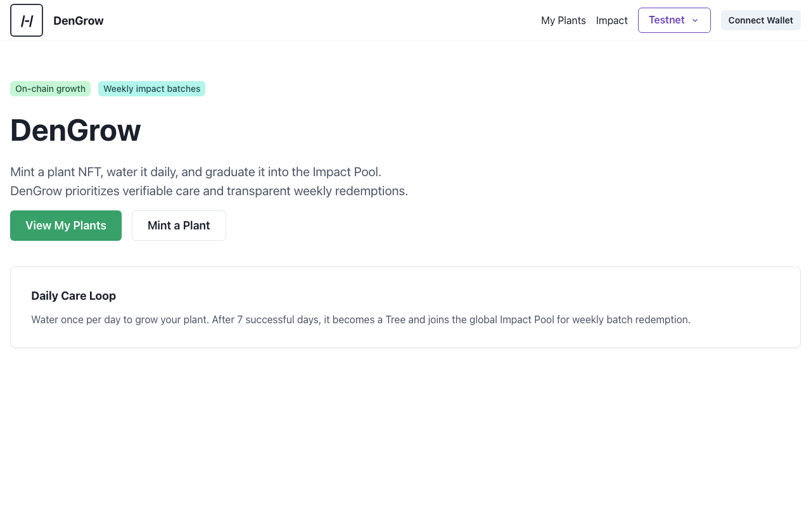
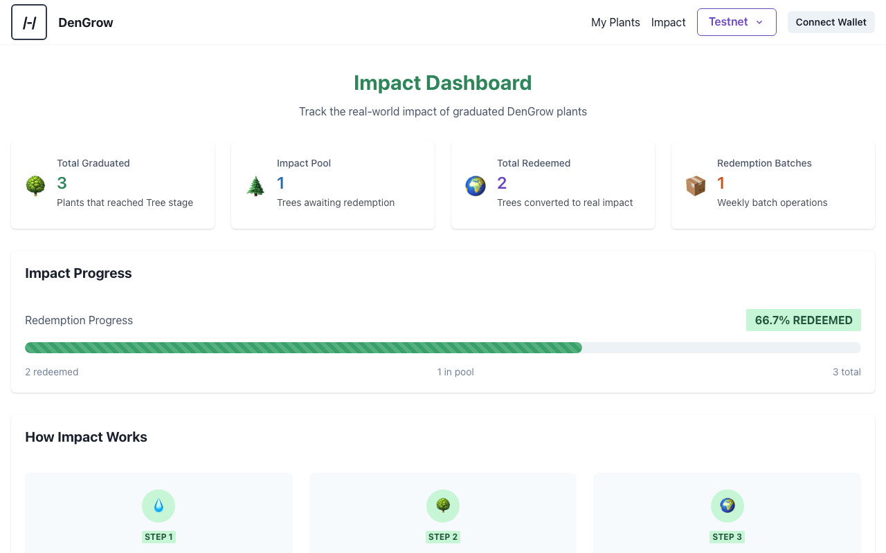

# DenGrow

**Grow a plant. Graduate a tree. Plant real impact.**

DenGrow is an on-chain plant NFT game built on [Stacks](https://www.stacks.co/) (Bitcoin L2). Users mint a virtual plant, nurture it daily through watering, and watch it evolve through 5 growth stages. When a plant graduates to a Tree, it enters a global **Impact Pool** — a transparent mechanism for converting virtual achievements into real-world tree planting.

## Features

- **Mint & Grow**: Choose from 3 seed tiers (Common, Premium, Legendary) and grow through Seed → Sprout → Plant → Bloom → Tree
- **Daily Care**: Water your plant once per day to earn growth points (7 points per stage)
- **Unique Traits**: 5 trait categories with rarity weighting generate unique visual combinations
- **Impact Pool**: Graduated trees enter a verifiable pool for batch redemption
- **Achievement Badges**: Earn on-chain badges for streaks, graduations, and collection milestones
- **Sponsored Batches**: Partners can sponsor impact batches with on-chain attribution
- **Treasury**: Dedicated on-chain treasury for managing Impact Pool funds
- **On-Chain Transparency**: All game state, graduations, and redemptions recorded on Stacks blockchain

## Live Demo

**Testnet**: [https://dengrow.vercel.app](https://dengrow.vercel.app)

**Repository**: [https://github.com/den-labs/dengrow](https://github.com/den-labs/dengrow)

## Screenshots

### Home Page


### Impact Dashboard


## Architecture

DenGrow uses an **upgradeable architecture** separating data from logic:

```
┌──────────────────────────────────────────────────────────────────┐
│                          CONTRACTS (7)                           │
├──────────────────────────────────────────────────────────────────┤
│                                                                  │
│  ┌──────────────┐    ┌──────────────┐                           │
│  │ plant-nft-v2 │───▶│plant-storage │◀── Data Layer (Immutable)│
│  └──────────────┘    └──────────────┘                           │
│         │                   ▲                                    │
│         │                   │                                    │
│         ▼                   │                                    │
│  ┌──────────────┐    ┌──────────────┐    ┌───────────────────┐  │
│  │plant-game-v1 │───▶│impact-registry│───▶│dengrow-treasury  │  │
│  └──────────────┘    └──────────────┘    └───────────────────┘  │
│   Logic Layer              │              Treasury (STX mgmt)    │
│   (Versionable)            ▼                                     │
│                    ┌───────────────────┐                         │
│                    │achievement-badges │                         │
│                    └───────────────────┘                         │
│                     Gamification Layer                            │
│                                                                  │
└──────────────────────────────────────────────────────────────────┘
```

| Contract | Purpose | Upgradeable |
|----------|---------|-------------|
| `plant-storage` | Stores all plant data (stage, growth, owner) | No |
| `plant-game-v1` | Game logic (water, cooldowns, progression) | Yes |
| `plant-nft-v2` | SIP-009 NFT standard with game hooks | Yes |
| `impact-registry` | Tracks graduated trees & batch redemptions | No |
| `achievement-badges` | On-chain badges for streaks and milestones | No |
| `dengrow-treasury` | Impact Pool treasury (holds/disburses STX) | No |
| `plant-game` | Legacy backward compatibility wrapper | No |

## Quick Start

### Prerequisites

- Node.js 18+
- pnpm (`npm install -g pnpm`)
- [Hiro Wallet](https://wallet.hiro.so/) browser extension

### Installation

```bash
# Clone the repository
git clone https://github.com/den-labs/dengrow.git
cd dengrow

# Install dependencies
pnpm install

# Set up environment
cp apps/web/.env.example apps/web/.env
```

Add your [Hiro Platform API key](https://platform.hiro.so/) to `apps/web/.env`:

```
NEXT_PUBLIC_PLATFORM_HIRO_API_KEY=your-api-key-here
```

### Run Locally

```bash
# Start the web app
pnpm dev

# Open http://localhost:3000
```

### Run Contract Tests

```bash
cd packages/contracts

# Run all 187 tests
pnpm test

# Run with coverage report
pnpm test:reports
```

## Deployed Contracts (Testnet)

| Contract | Address |
|----------|---------|
| plant-storage | [`ST23SRWT9A0CYMPW4Q32D0D7KT2YY07PQAVJY3NJZ.plant-storage`](https://explorer.hiro.so/txid/ST23SRWT9A0CYMPW4Q32D0D7KT2YY07PQAVJY3NJZ.plant-storage?chain=testnet) |
| plant-game-v1 | [`ST23SRWT9A0CYMPW4Q32D0D7KT2YY07PQAVJY3NJZ.plant-game-v1`](https://explorer.hiro.so/txid/ST23SRWT9A0CYMPW4Q32D0D7KT2YY07PQAVJY3NJZ.plant-game-v1?chain=testnet) |
| plant-nft-v2 | [`ST23SRWT9A0CYMPW4Q32D0D7KT2YY07PQAVJY3NJZ.plant-nft-v2`](https://explorer.hiro.so/txid/ST23SRWT9A0CYMPW4Q32D0D7KT2YY07PQAVJY3NJZ.plant-nft-v2?chain=testnet) |
| impact-registry | [`ST23SRWT9A0CYMPW4Q32D0D7KT2YY07PQAVJY3NJZ.impact-registry`](https://explorer.hiro.so/txid/ST23SRWT9A0CYMPW4Q32D0D7KT2YY07PQAVJY3NJZ.impact-registry?chain=testnet) |
| achievement-badges | [`ST23SRWT9A0CYMPW4Q32D0D7KT2YY07PQAVJY3NJZ.achievement-badges`](https://explorer.hiro.so/txid/ST23SRWT9A0CYMPW4Q32D0D7KT2YY07PQAVJY3NJZ.achievement-badges?chain=testnet) |
| dengrow-treasury | [`ST23SRWT9A0CYMPW4Q32D0D7KT2YY07PQAVJY3NJZ.dengrow-treasury`](https://explorer.hiro.so/txid/ST23SRWT9A0CYMPW4Q32D0D7KT2YY07PQAVJY3NJZ.dengrow-treasury?chain=testnet) |

**Deployer**: `ST23SRWT9A0CYMPW4Q32D0D7KT2YY07PQAVJY3NJZ`

## Game Mechanics

### Growth Stages

| Stage | Points Required | Visual |
|-------|-----------------|--------|
| Seed | 0 | Starting state |
| Sprout | 7 | First leaves |
| Plant | 14 | Growing stems |
| Bloom | 21 | Flowers appear |
| Tree | 28 | **Graduated!** |

### Watering Rules

- Water once per day (144 blocks on mainnet, instant on testnet)
- Each successful water = +1 growth point
- After 7 waters, plant advances to next stage
- Tree stage = graduation to Impact Pool

### Impact Pool

When a plant reaches Tree stage:
1. Automatically registered in `impact-registry`
2. Enters the global Impact Pool
3. Admin records batch redemptions with proof
4. Proof includes hash + URL for verification

## Project Structure

```
dengrow/
├── apps/
│   └── web/                 # Next.js 14 frontend (App Router)
│       ├── src/app/         # Routes (/, /my-plants, /leaderboard, /achievements, /impact)
│       ├── src/components/  # React components (plants/, ui/ via shadcn)
│       ├── src/hooks/       # Custom hooks for contract calls
│       └── src/lib/         # Utilities (game/, nft/, network)
├── packages/
│   └── contracts/           # Clarity 2.0 smart contracts (7 contracts)
│       ├── contracts/       # .clar files
│       ├── tests/           # 187 tests (Vitest + Clarinet SDK)
│       └── scripts/         # Deployment & admin scripts
└── docs/                    # Documentation
```

## Admin Operations

For project administrators:

```bash
cd packages/contracts

# Deploy impact-registry (if needed)
pnpm deploy:impact-registry

# Register existing graduated plants
pnpm register:graduated

# Record a redemption batch
pnpm redeem -- --quantity 5 --proof-url "https://example.com/proof.pdf"
```

## Documentation

- [Product Requirements (PRD)](docs/PRD.md)
- [Master Plan & Milestones](docs/MASTER_PLAN.md)
- [Deployment Guide](docs/DEPLOYMENT.md)
- [Task Backlog](docs/TASKS.md)
- [Roadmap](docs/ROADMAP.md)
- [Security Considerations](docs/SECURITY.md)
- [Impact Policy](docs/IMPACT_POLICY.md)

## Tech Stack

- **Blockchain**: [Stacks](https://www.stacks.co/) (Bitcoin L2)
- **Smart Contracts**: [Clarity 2.0](https://docs.stacks.co/clarity) — 7 contracts, 187 tests
- **Frontend**: Next.js 14 (App Router), React 18, shadcn/ui, Tailwind CSS 3
- **Design System**: Outfit font, DenGrow color palette, custom shadows and gradients
- **Testing**: Vitest + Clarinet SDK (contracts), Next.js build (web)
- **Wallet**: Hiro Wallet via @stacks/connect v8
- **Package Manager**: pnpm 9 + Turborepo

## Contributing

Contributions welcome! Please read the contributing guidelines before submitting PRs.

1. Fork the repository
2. Create your feature branch (`git checkout -b feature/amazing-feature`)
3. Commit your changes (`git commit -m 'Add amazing feature'`)
4. Push to the branch (`git push origin feature/amazing-feature`)
5. Open a Pull Request

## License

MIT License - see [LICENSE](LICENSE) file for details.

---

**Built with care for the Stacks ecosystem.**
